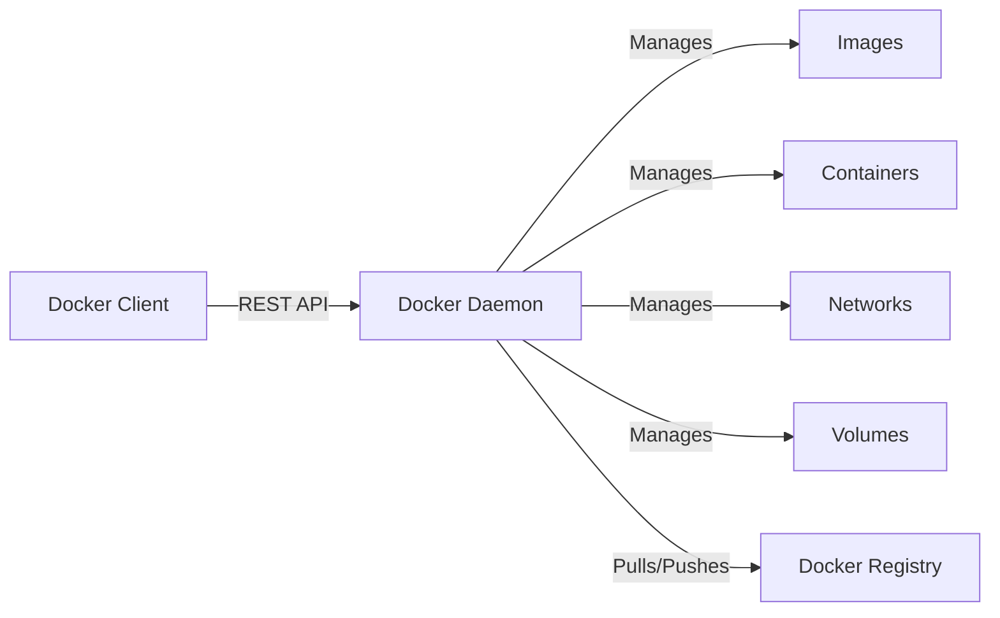

# Docker – The DevOps Standard

## 1. Docker Architecture
Docker uses a client-server architecture. The client talks to the Docker daemon, which does the heavy lifting of building, running, and distributing your containers.



*   **Docker Daemon (`dockerd`):** Listens for API requests and manages objects (images, containers, networks, volumes).
*   **Docker Client (`docker`):** The primary way users interact with Docker.
*   **Docker Registry:** Stores Docker images (e.g., Docker Hub, AWS ECR).

## 2. Images vs. Containers
*   **Image:** Read-only template with instructions to create a container. Think "Class" in OOP.
*   **Container:** Runnable instance of an image. Think "Object" in OOP.

| Feature | Image | Container |
| :--- | :--- | :--- |
| **State** | Immutable (Read-only) | Mutable (Read-write layer on top) |
| **Storage** | Stored in Registry/Local Cache | Ephemeral (unless using volumes) |
| **Analogy** | Application Binary (.exe) | Running Process |

## 3. Volumes & Networks

### Data Persistence (Volumes)
Containers are ephemeral. If a container crashes, data inside it is lost.
*   **Volumes:** Managed by Docker (`/var/lib/docker/volumes`). Best for persistence.
*   **Bind Mounts:** Maps a host file/directory to the container. Best for local dev.

```bash
# Create a volume
docker volume create my-db-data

# Run with volume
docker run -v my-db-data:/var/lib/postgresql/data postgres
```

### Networking
*   **Bridge:** Default. Containers on the same bridge can talk to each other.
*   **Host:** Container shares the host's network stack (no port mapping needed).
*   **Overlay:** Connects multiple Docker daemons (Swarm/Kubernetes).

## 4. Dockerfile Best Practices

### Bad Dockerfile ❌
```dockerfile
FROM ubuntu
COPY . /app
RUN apt-get update
RUN apt-get install -y python3
CMD ["python3", "/app/main.py"]
```

### Good Dockerfile ✅
```dockerfile
# 1. Use specific, slim base images
FROM python:3.9-slim-buster

# 2. Set working directory
WORKDIR /app

# 3. Copy requirements first (Cache busting)
COPY requirements.txt .

# 4. Install dependencies in one layer & clean up
RUN pip install --no-cache-dir -r requirements.txt && \
    rm -rf /root/.cache

# 5. Copy source code
COPY . .

# 6. Run as non-root user
RUN useradd -m appuser
USER appuser

CMD ["python3", "main.py"]
```

**Key Principles:**
1.  **Layer Caching:** Order matters. Least changing steps (installing deps) first, most changing (copying code) last.
2.  **Minimize Layers:** Combine `RUN` commands.
3.  **Least Privilege:** Always run as a non-root user.
4.  **Small Base Images:** Use `alpine` or `slim` variants to reduce attack surface and download time.

## 5. Multi-Stage Builds
Drastically reduce image size by separating build tools from runtime artifacts.

```dockerfile
# Stage 1: Build
FROM golang:1.19 AS builder
WORKDIR /app
COPY . .
RUN go build -o myapp main.go

# Stage 2: Runtime (Tiny image)
FROM alpine:latest
WORKDIR /root/
COPY --from=builder /app/myapp .
CMD ["./myapp"]
```
*Result: 800MB (Golang image) -> 15MB (Alpine + Binary)*

## 6. Security
*   **Scan Images:** Use `trivy` or `docker scan` to find CVEs.
*   **Read-Only Filesystem:** Run containers with `--read-only` where possible.
*   **Secrets:** Never bake secrets (API keys) into the image. Use Environment Variables or Docker Secrets.
*   **Limit Resources:** Prevent DoS attacks.
    ```bash
    docker run --memory="512m" --cpus="1.0" nginx
    ```

## 7. Debugging Containers

| Scenario | Command |
| :--- | :--- |
| **Container crashed immediately** | `docker logs <container_id>` |
| **Need to check files inside** | `docker exec -it <container_id> /bin/sh` |
| **Check resource usage** | `docker stats` |
| **Inspect configuration** | `docker inspect <container_id>` |
| **Check network connections** | `docker network inspect <network_name>` |

## 8. Real Deployment Workflows

### Local Development
`docker-compose.yml` orchestrates multi-container apps (App + DB + Redis).
```yaml
version: '3.8'
services:
  web:
    build: .
    ports: ["8000:8000"]
    volumes: [".:/app"] # Hot reload
  db:
    image: postgres:13
    environment:
      POSTGRES_PASSWORD: example
```

### CI/CD Pipeline (GitHub Actions Example)
1.  **Checkout Code**
2.  **Build Image:** `docker build -t myapp:${{ github.sha }} .`
3.  **Scan Image:** Run Trivy scan.
4.  **Push to Registry:** `docker push myregistry.com/myapp:${{ github.sha }}`
5.  **Deploy:** Update K8s manifest or trigger SSH deployment.

## 9. Mini Lab: Multi-Stage Go Build
**Goal:** Create a tiny Docker image for a Go web server.

1.  **Create `main.go`**
    ```go
    package main
    import ("fmt"; "net/http")
    func handler(w http.ResponseWriter, r *http.Request) {
        fmt.Fprintf(w, "Hello from Docker!")
    }
    func main() {
        http.HandleFunc("/", handler)
        http.ListenAndServe(":8080", nil)
    }
    ```

2.  **Create `Dockerfile`** (Use the Multi-Stage example above).

3.  **Build & Run**
    ```bash
    docker build -t go-mini .
    docker run -d -p 8080:8080 go-mini
    curl localhost:8080
    ```

4.  **Verify Size**
    ```bash
    docker images | grep go-mini
    # Should be < 20MB
    ```
