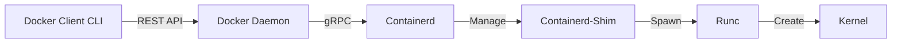
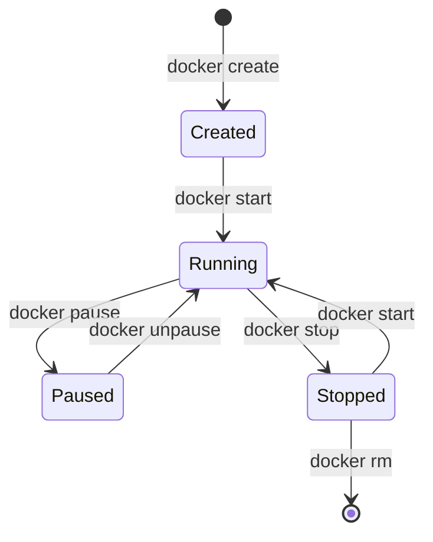

# Docker: Kapsamlı Mimari, Mühendislik ve Çalışma Prensipleri

> [!NOTE]
> **Döküman Tipi:** Derinlemesine Teknik Analiz | **Seviye:** İleri

---

## İçindekiler
1.  [Docker Felsefesi: Değişmez Altyapı](#1-docker-felsefesi-değişmez-altyapı-immutable-infrastructure)
2.  [Docker Mimarisi: Derinlemesine Bakış](#2-docker-mimarisi-derinlemesine-bakış)
3.  [Linux Kernel Teknolojileri](#3-linux-kernel-teknolojileri-namespace--cgroups)
4.  [Dosya Sistemi Mimarisi](#4-dosya-sistemi-mimarisi-unionfs-ve-katmanlar)
5.  [Container Network Model](#5-container-network-model-cnm)
6.  [İşletim Sistemleri Uyumu](#6-dockerın-farklı-işletim-sistemlerinde-çalışma-mekanizması)
7.  [Container Yaşam Döngüsü](#7-container-yaşam-döngüsü-lifecycle)
8.  [OCI Standartları](#8-oci-standartları-ve-runtime-ekosistemi)
9.  [Güvenlik Mimarisi](#9-güvenlik-mimarisi)

---

## 1. Docker Felsefesi: Değişmez Altyapı (Immutable Infrastructure)

Docker sadece bir araç değil, yazılım dağıtımında bir paradigma değişimidir. Geleneksel "Pet vs Cattle" (Evcil Hayvan vs Sürü) analojisini hayata geçirir.

### 1.1 Mutable vs Immutable

> [!WARNING]
> **Geleneksel (Mutable - Pet)**
> Sunucu kurulur, üzerine uygulama atılır. Güncelleme geldiğinde sunucuya bağlanılır, yamalar yapılır, kütüphaneler güncellenir. Bu zamanla sunucuda "Configuration Drift" (Yapılandırma Kayması) yaratır. Sunucu bozulursa tamiri zordur.

> [!TIP]
> **Docker (Immutable - Cattle)**
> Sunucu veya container asla güncellenmez/yama yapılmaz. Yeni versiyon mu geldi? Eskisi çöpe atılır, yenisi sıfırdan oluşturulur. Bu, her dağıtımın %100 temiz ve tahmin edilebilir olmasını sağlar.

### 1.2 "Matrix of Hell" Sorunu
Geliştirme, Test ve Prod ortamlarında; OS versiyonu, Python versiyonu, kütüphane patch seviyelerinin uyuşmazlığı kriz yaratır. Docker, uygulamayı **Runtime Environment** (Çalışma Ortamı) ile birlikte paketleyerek bu matrisi yok eder.

---

## 2. Docker Mimarisi: Derinlemesine Bakış

Docker, modüler bir **Client-Server** mimarisine sahiptir. Bir komut yazdığınızda arka planda şu akış gerçekleşir:

### 2.1 Bileşenler ve Akış

1.  **Docker Client (CLI):** Kullanıcının yazdığı `docker run` komutunu REST API isteğine çevirir.
2.  **Docker Socket (`/var/run/docker.sock`):** Client ile Daemon arasındaki iletişim kanalıdır.
3.  **Docker Daemon (`dockerd`):** API isteklerini karşılayan, yüksek seviyeli yöneticidir. Ancak container'ı kendisi başlatmaz. İşi `containerd`'ye devreder.
4.  **Containerd:** Endüstri standardı container yöneticisidir. Image pull etme, storage yönetimi ve container yaşam döngüsünü yönetir.
5.  **Containerd-Shim:** Her container için aracı bir süreçtir. Container başlatıldıktan sonra Daemon çökse veya restart olsa bile container'ın çalışmaya devam etmesini sağlar (Daemonless containers).
6.  **Runc:** Kernel ile konuşan en alt seviye CLI aracıdır. Container'ı oluşturur (spawn) ve işlem bitince çıkar.

> **Özet Akış:** CLI → Dockerd → Containerd → Shim → Runc → Kernel

---

## 3. Linux Kernel Teknolojileri (Namespace & Cgroups)

Docker bir sanallaştırma (virtualization) değil, bir **izolasyon** teknolojisidir. Bu izolasyonu sağlayan Linux Kernel özellikleridir.

### 3.1 Namespaces (Görünürlük İzolasyonu)
Container'ın "Ben tek başınayım" sanmasını sağlayan duvarlardır. 6 temel namespace vardır:

| Namespace | Açıklama |
| :--- | :--- |
| **PID** | Container içindeki process ID'leri izole eder. Host'ta PID 4500 olan bir işlem, container içinde PID 1 olarak görünür. |
| **NET** | Container'a özel sanal ağ arayüzü (eth0), IP adresi ve routing tablosu sağlar. |
| **MNT** | Container'a özel dosya sistemi bağlama noktaları sağlar. |
| **UTS** | Hostname ve domain name izolasyonu sağlar. |
| **IPC** | İşlemler arası iletişimi (Shared Memory) izole eder. |
| **USER** | Container içindeki root kullanıcısını, host makinedeki yetkisiz bir kullanıcıya eşler. |

### 3.2 Control Groups (Cgroups - Kaynak İzolasyonu)
Container'ın kaynak kullanımını limitleyen ve raporlayan mekanizmadır.
*   **Resource Limiting:** "Bu container en fazla 512MB RAM ve 0.5 CPU kullanabilsin."
*   **Prioritization:** "CPU sıkışırsa, Prod container'ına Test container'ından daha fazla öncelik ver."
*   **Accounting:** "Bu container ne kadar kaynak tüketti?" (Monitoring araçları veriyi buradan çeker).

---

## 4. Dosya Sistemi Mimarisi: UnionFS ve Katmanlar

Docker'ın disk verimliliği ve hızı, **Union File System (UnionFS)** mimarisine dayanır.

### 4.1 Image Katmanları (Layers)
Bir Docker imajı, salt okunur (read-only) katmanların üst üste binmesinden oluşur.
*   Örnek: `Ubuntu Base` + `Python Runtime` + `Uygulama Kodu`.
*   Her katman, bir önceki katmandan farkı (delta) tutar.
*   **Verimlilik:** 10 farklı uygulama `Ubuntu` tabanını kullanıyorsa, Ubuntu katmanı diskte sadece **bir kez** saklanır.

### 4.2 Copy-on-Write (CoW) Stratejisi
Container çalıştırıldığında, read-only imaj katmanlarının en tepesine **"Thin Writable Layer"** (İnce Yazılabilir Katman) eklenir.

1.  **Okuma:** Veri alt katmanlardan okunur.
2.  **Yazma:** Bir dosya değiştirilmek istendiğinde, dosya alt katmandan (imajdan) üstteki yazılabilir katmana **kopyalanır** ve orada değiştirilir. Orijinal imaj asla bozulmaz.

> [!IMPORTANT]
> Bu işlem, yoğun I/O (Database gibi) işlemleri için performans kaybı yaratabilir. Bu yüzden veritabanları için **Volume** (doğrudan disk erişimi) kullanılır.

### 4.3 Storage Drivers
Bu katmanlı yapıyı yöneten arka uç sürücüleridir:
*   **Overlay2:** Modern Linux dağıtımlarında standarttır. Hızlı ve verimlidir.
*   **Fuse-overlayfs:** Rootless mod için kullanılır.
*   **Btrfs / ZFS:** Gelişmiş dosya sistemi özellikleri sunan özel sürücüler.

---

## 5. Container Network Model (CNM)

Docker'da ağ, container'ların birbiriyle ve dış dünyayla konuşmasını sağlayan soyut bir katmandır.

### 5.1 Temel Network Sürücüleri

| Sürücü | Açıklama |
| :--- | :--- |
| **Bridge** | Varsayılan. Docker host üzerinde sanal bir köprü (docker0) oluşturur. NAT üzerinden dışarı çıkar. |
| **Host** | İzolasyonu kaldırır. Container, host makinenin ağ kartını doğrudan kullanır. Performans çok yüksektir. |
| **None** | Ağ yok. Tamamen izole. Sadece loopback (localhost) çalışır. |
| **Overlay** | Swarm/Kubernetes Cluster üzerindeki container'ların aynı ağdaymış gibi konuşmasını sağlar. |
| **Macvlan** | Container'a fiziksel ağdan gerçek bir MAC adresi atar. |

---

## 6. Docker'ın Farklı İşletim Sistemlerinde Çalışma Mekanizması

Docker bir Linux teknolojisidir. Diğer işletim sistemlerinde çalışması için "Hile" (Emulation/Virtualization) yapar.

### 6.1 Linux (Native Performance)
*   Doğrudan Kernel syscall'larını kullanır.
*   Arada sanallaştırma katmanı yoktur.
*   Performans kaybı ihmal edilebilir düzeydedir (<%1).

### 6.2 macOS (VM Tabanlı)
macOS, UNIX tabanlıdır (Darwin Kernel) ancak Linux Namespaces/Cgroups özelliklerine sahip değildir.
*   **Mimari:** Docker Desktop veya Colima, arka planda (HyperKit veya QEMU ile) minimalist bir **Linux VM** çalıştırır.
*   **Docker Daemon:** Mac'te değil, o gizli Linux VM'in içinde çalışır.
*   **Dosya Paylaşımı:** Mac dosya sistemi Linux VM'e ağ üzerinden bağlanır. Bu nedenle Mac'te dosya I/O performansı Linux'a göre yavaştır.

### 6.3 Windows (WSL 2 vs Hyper-V)
*   **WSL 2 (Önerilen):** Windows içine gömülü gerçek Linux çekirdeğidir. Docker burada native Linux performansına çok yakın çalışır.
*   **Windows Containers:** Windows Kernel'inin sağladığı izolasyonu kullanır. Sadece Windows tabanlı uygulamalar çalıştırabilir.

---

## 7. Container Yaşam Döngüsü (Lifecycle)

Bir container sadece "Açık" veya "Kapalı" değildir. Bir durum makinesi (State Machine) gibi davranır.

1.  **Created:** Container oluşturuldu ama başlatılmadı (`docker create`).
2.  **Running:** Process çalışıyor, kaynak tüketiyor (`docker start`).
3.  **Paused:** Process'ler donduruldu (SIGSTOP sinyali). Bellekte durur ama CPU kullanmaz.
4.  **Stopped/Exited:** Process sonlandı veya durduruldu. Dosya sistemi korunur, tekrar başlatılabilir.
5.  **Dead/Removed:** Container sistemden tamamen silindi.

---

## 8. OCI Standartları ve Runtime Ekosistemi

Docker ilk çıktığında tekeldi. Ancak Kubernetes ve diğer firmaların baskısıyla teknoloji standartlaştırıldı (Open Container Initiative - OCI).

### 8.1 Image Spec
"Bir container imajı binary olarak nasıl görünmeli?" sorusunun cevabıdır. Bu standart sayesinde Docker ile build ettiğiniz imajı, Docker olmayan ortamlarda (OpenShift, Podman, Kubernetes) çalıştırabilirsiniz.

### 8.2 Runtime Spec
"Bir container nasıl çalıştırılmalı?" standardıdır.
*   **High-Level Runtime:** Docker, Containerd, CRI-O (Image çekme, yönetme işleri).
*   **Low-Level Runtime:** Runc, crun, gVisor, Kata Containers (Kernel ile konuşma işleri).

---

## 9. Güvenlik Mimarisi

Containerlar sanal makineler kadar izole **değildir**. Aynı çekirdeği paylaşırlar.

### 9.1 Saldırı Yüzeyi
> [!CAUTION]
> Eğer bir saldırgan container içinden Kernel'e sızmayı başarırsa (Kernel Exploit), tüm host makineyi ele geçirebilir.

### 9.2 Güvenlik Katmanları
1.  **Rootless Mode:** Docker Daemon ve container'ların root yetkisi olmadan çalıştırılması.
2.  **Capabilities (Yetenekler):** Linux'ta "Root" yetkisi tek parça değildir. Docker, varsayılan olarak container'daki root kullanıcısının yeteneklerini budar.
3.  **Seccomp (Secure Computing Mode):** Container'ın yapabileceği System Call'ları sınırlar.
4.  **Read-Only Root Filesystem:** Container'ın kök dizinini salt okunur yaparak saldırganın dosya değiştirmesini engellemek.

---
*Bu doküman, Docker'ın sadece bir "komut seti" değil, modern yazılım mühendisliğinin temel taşı olan derin bir mimari olduğunu göstermektedir.*