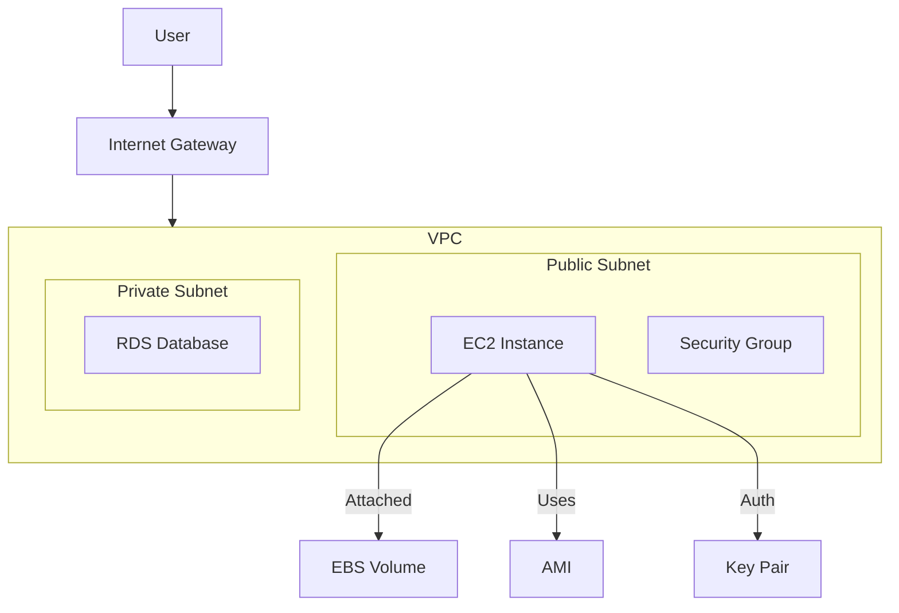

# AWS EC2 – The Backbone of the Cloud

## 1. What It Solves
Before Cloud: You had to buy physical servers, wait weeks for delivery, rack them, and guess your capacity needs.
**With EC2 (Elastic Compute Cloud):** You rent virtual servers (Instances) on-demand. You pay only for what you use, scale up/down instantly, and have total control over the OS.

## 2. Architecture & Key Components

### Architecture Diagram


### Key Components
1.  **AMI (Amazon Machine Image):** The blueprint (OS + App Server + Applications).
2.  **Instance Type:** Hardware configuration (CPU, RAM, Network).
    *   `t3.micro`: General Purpose (Burstable).
    *   `c5.large`: Compute Optimized (High CPU).
    *   `r5.large`: Memory Optimized (High RAM).
3.  **EBS (Elastic Block Store):** The virtual hard drive. Persists data even if the instance stops.
4.  **Security Groups:** Virtual Firewall. Stateful (Return traffic allowed automatically).
5.  **Key Pairs:** SSH keys for login (PEM/PPK).
6.  **User Data:** Script that runs *only once* upon first boot (bootstrapping).

## 3. Real Deployment Patterns

### Pattern A: The Bastion Host (Jump Box)
*   **Goal:** Securely access private instances.
*   **Setup:** Public EC2 instance (Bastion) allows SSH only from your IP. Private instances allow SSH only from Bastion SG.

### Pattern B: Auto Scaling Group (ASG) + Load Balancer (ALB)
*   **Goal:** High Availability and Elasticity.
*   **Setup:** ALB distributes traffic to EC2 instances across multiple Availability Zones (AZs). ASG adds/removes instances based on CPU load.

## 4. Security Best Practices
1.  **Least Privilege:** Open ports only to specific IPs (e.g., SSH port 22 only to your VPN/Office IP).
2.  **IAM Roles:** NEVER store AWS Access Keys on the instance. Attach an IAM Role instead.
3.  **Private Subnets:** Put backend servers/DBs in private subnets (no public IP).
4.  **Regular Patching:** Use Systems Manager (SSM) Patch Manager.

## 5. Cost Optimization
*   **On-Demand:** Pay by the second. Good for short-term, irregular workloads.
*   **Reserved Instances (RI):** Commit to 1 or 3 years. Up to 72% discount. Good for steady-state.
*   **Savings Plans:** Flexible commitment (e.g., $10/hour). Applies to EC2, Fargate, Lambda.
*   **Spot Instances:** Bid on unused capacity. Up to 90% discount. Can be interrupted with 2-minute warning. Good for batch jobs, CI/CD.

## 6. Infrastructure as Code (Terraform)

```hcl
resource "aws_instance" "web" {
  ami           = "ami-0c55b159cbfafe1f0" # Amazon Linux 2
  instance_type = "t2.micro"
  key_name      = "my-key-pair"

  vpc_security_group_ids = [aws_security_group.web_sg.id]

  user_data = <<-EOF
              #!/bin/bash
              yum update -y
              yum install -y httpd
              systemctl start httpd
              echo "Hello from Terraform" > /var/www/html/index.html
              EOF

  tags = {
    Name = "WebServer"
  }
}
```

## 7. AWS CLI Examples

| Action | Command |
| :--- | :--- |
| **Launch Instance** | `aws ec2 run-instances --image-id ami-xxx --count 1 --instance-type t2.micro --key-name MyKey` |
| **List Instances** | `aws ec2 describe-instances --filters "Name=instance-type,Values=t2.micro"` |
| **Stop Instance** | `aws ec2 stop-instances --instance-ids i-1234567890abcdef0` |
| **Create Key Pair** | `aws ec2 create-key-pair --key-name MyKeyPair --query 'KeyMaterial' --output text > MyKeyPair.pem` |

## 8. Common Exam Questions (SAA-C03 / DVA-C02)

**Q1: You need a high-performance database on EC2. Which EBS volume type do you choose?**
*   A) Cold HDD (sc1)
*   B) General Purpose SSD (gp3)
*   C) Provisioned IOPS SSD (io2) ✅
*   D) Throughput Optimized HDD (st1)
*   *Reason: Databases need high IOPS and low latency.*

**Q2: How do you securely pass database credentials to an EC2 application?**
*   A) Hardcode in source code.
*   B) Store in User Data.
*   C) Use AWS Systems Manager Parameter Store. ✅
*   D) Save in a text file on S3.
*   *Reason: Parameter Store (or Secrets Manager) is secure and supports encryption.*

**Q3: Your Spot Instance is about to be reclaimed. How much notice do you get?**
*   A) 30 seconds
*   B) 2 minutes ✅
*   C) 5 minutes
*   D) No notice
