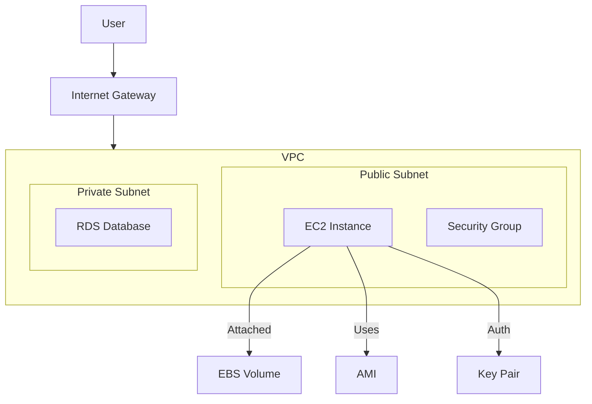

# AWS EC2 – Bulutun Omurgası

## 1. Hangi Sorunu Çözer?
Buluttan Önce: Fiziksel sunucular satın almanız, teslimat için haftalarca beklemeniz, onları raflara yerleştirmeniz ve kapasite ihtiyaçlarınızı tahmin etmeniz gerekirdi.
**EC2 (Elastic Compute Cloud) ile:** İhtiyacınız olduğunda sanal sunucular (Instance) kiralarsınız. Sadece kullandığınız kadar ödersiniz, anında ölçeklendirirsiniz (büyütüp/küçültebilirsiniz) ve İşletim Sistemi üzerinde tam kontrole sahip olursunuz.

## 2. Mimari ve Temel Bileşenler

### Mimari Diyagramı


### Temel Bileşenler
1.  **AMI (Amazon Machine Image):** Şablon (İşletim Sistemi + Uygulama Sunucusu + Uygulamalar).
2.  **Instance Type:** Donanım yapılandırması (CPU, RAM, Ağ).
    *   `t3.micro`: Genel Amaçlı (Burstable - Ani performans artışlı).
    *   `c5.large`: İşlemci Odaklı (Yüksek CPU).
    *   `r5.large`: Bellek Odaklı (Yüksek RAM).
3.  **EBS (Elastic Block Store):** Sanal sabit disk. Instance dursa bile veriler kalıcıdır.
4.  **Security Groups:** Sanal Güvenlik Duvarı. Durum bilgisi tutar (Stateful - Giden trafiğin dönüşüne otomatik izin verir).
5.  **Key Pairs:** Giriş yapmak için SSH anahtarları (PEM/PPK).
6.  **User Data:** İlk açılışta *sadece bir kez* çalışan script (bootstrapping).

## 3. Gerçek Dağıtım Senaryoları

### Senaryo A: Bastion Host (Jump Box)
*   **Amaç:** Özel (Private) instance'lara güvenli erişim sağlamak.
*   **Kurulum:** Public EC2 instance (Bastion) sadece sizin IP'nizden gelen SSH'a izin verir. Private instance'lar ise sadece Bastion'ın Security Group'undan gelen SSH'a izin verir.

### Senaryo B: Auto Scaling Group (ASG) + Load Balancer (ALB)
*   **Amaç:** Yüksek Erişilebilirlik ve Esneklik.
*   **Kurulum:** ALB, trafiği birden fazla Availability Zone (AZ) üzerindeki EC2 instance'larına dağıtır. ASG, CPU yüküne göre otomatik olarak instance ekler veya çıkarır.

## 4. Güvenlik En İyi Uygulamaları (Best Practices)
1.  **En Az Yetki (Least Privilege):** Portları sadece belirli IP'lere açın (örn: SSH port 22 sadece VPN/Ofis IP'nize).
2.  **IAM Rolleri:** AWS Access Key'lerini ASLA instance içinde saklamayın. Bunun yerine bir IAM Rolü atayın.
3.  **Private Subnet:** Backend sunucularını/Veritabanlarını private subnet'lere koyun (Public IP olmasın).
4.  **Düzenli Yama (Patching):** Systems Manager (SSM) Patch Manager kullanın.

## 5. Maliyet Optimizasyonu
*   **On-Demand:** Saniye bazlı ödeme. Kısa vadeli, düzensiz iş yükleri için iyidir.
*   **Reserved Instances (RI):** 1 veya 3 yıllık taahhüt. %72'ye varan indirim. Sürekli çalışan sistemler için iyidir.
*   **Savings Plans:** Esnek taahhüt (örn: saatlik $10 harcama sözü). EC2, Fargate, Lambda için geçerlidir.
*   **Spot Instances:** Kullanılmayan kapasiteye teklif verin. %90'a varan indirim. 2 dakika uyarı ile kesilebilir. Batch işleri, CI/CD için iyidir.

## 6. Infrastructure as Code (Terraform)

```hcl
resource "aws_instance" "web" {
  ami           = "ami-0c55b159cbfafe1f0" # Amazon Linux 2
  instance_type = "t2.micro"
  key_name      = "my-key-pair"

  vpc_security_group_ids = [aws_security_group.web_sg.id]

  user_data = <<-EOF
              #!/bin/bash
              yum update -y
              yum install -y httpd
              systemctl start httpd
              echo "Terraform'dan Merhaba" > /var/www/html/index.html
              EOF

  tags = {
    Name = "WebServer"
  }
}
```

## 7. AWS CLI Örnekleri

| İşlem | Komut |
| :--- | :--- |
| **Instance Başlat** | `aws ec2 run-instances --image-id ami-xxx --count 1 --instance-type t2.micro --key-name MyKey` |
| **Instance Listele** | `aws ec2 describe-instances --filters "Name=instance-type,Values=t2.micro"` |
| **Instance Durdur** | `aws ec2 stop-instances --instance-ids i-1234567890abcdef0` |
| **Key Pair Oluştur** | `aws ec2 create-key-pair --key-name MyKeyPair --query 'KeyMaterial' --output text > MyKeyPair.pem` |

## 8. Sık Karşılaşılan Sınav Soruları (SAA-C03 / DVA-C02)

**S1: EC2 üzerinde yüksek performanslı bir veritabanına ihtiyacınız var. Hangi EBS disk tipini seçersiniz?**
*   A) Cold HDD (sc1)
*   B) General Purpose SSD (gp3)
*   C) Provisioned IOPS SSD (io2) ✅
*   D) Throughput Optimized HDD (st1)
*   *Sebep: Veritabanları yüksek IOPS ve düşük gecikme süresine ihtiyaç duyar.*

**S2: Veritabanı şifrelerini bir EC2 uygulamasına güvenli bir şekilde nasıl iletirsiniz?**
*   A) Kaynak kodun içine gömerek.
*   B) User Data içinde saklayarak.
*   C) AWS Systems Manager Parameter Store kullanarak. ✅
*   D) S3 üzerindeki bir metin dosyasına kaydederek.
*   *Sebep: Parameter Store (veya Secrets Manager) güvenlidir ve şifrelemeyi destekler.*

**S3: Spot Instance'ınız geri alınmak üzere. Ne kadar süre önce uyarı alırsınız?**
*   A) 30 saniye
*   B) 2 dakika ✅
*   C) 5 dakika
*   D) Uyarı verilmez
