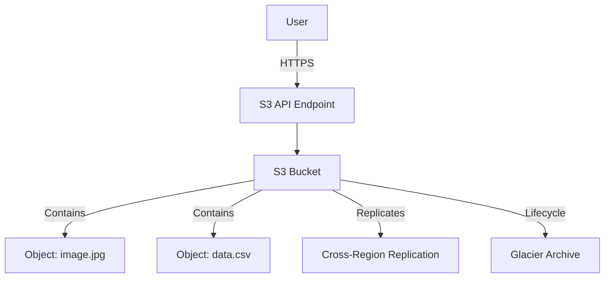

# AWS S3 – Infinite Storage for the Cloud

## 1. What It Solves
Before Cloud: You had to manage SAN/NAS, worry about running out of disk space, and handle complex backups.
**With S3 (Simple Storage Service):** You get infinite, durable object storage. You don't manage servers or file systems. You just upload files (objects) and pay for what you store.

## 2. Architecture & Key Components

### Architecture Diagram


### Key Components
1.  **Bucket:** A container for objects. Must have a **globally unique name** (DNS compliant). Region-specific.
2.  **Object:** The file itself. Consists of:
    *   **Key:** The name (e.g., `photos/2023/beach.jpg`).
    *   **Value:** The data (bytes).
    *   **Metadata:** System (date, size) & User-defined tags.
3.  **Region:** Buckets live in a specific AWS region (e.g., `us-east-1`), but the namespace is global.
4.  **Consistency:** Strong consistency for all PUTs and DELETEs (read-after-write).

## 3. Real Deployment Patterns

### Pattern A: Static Website Hosting
*   **Goal:** Host a React/Vue/Angular app cheaply.
*   **Setup:** Enable "Static Website Hosting" on the bucket. Point Route53 to the bucket endpoint. Use CloudFront for HTTPS and caching.

### Pattern B: Data Lake
*   **Goal:** Store raw data from logs, IoT, and DB dumps for analytics.
*   **Setup:** Ingest data into S3. Use Athena to query it directly using SQL. Use Glue for ETL.

### Pattern C: Hybrid Backup
*   **Goal:** Backup on-premise server data to the cloud.
*   **Setup:** Use AWS Storage Gateway (File Gateway) to mount an S3 bucket as a local NFS drive on your on-prem server.

## 4. Security Best Practices
1.  **Block Public Access:** Enable "Block Public Access" at the account or bucket level unless it's a public website.
2.  **Bucket Policies:** JSON-based policies to control access (e.g., "Only allow CloudFront to read files").
3.  **Encryption:**
    *   **SSE-S3:** AWS-managed keys (Default).
    *   **SSE-KMS:** Customer-managed keys (More control, audit logs).
4.  **Versioning:** Enable versioning to protect against accidental deletes or overwrites.

## 5. Cost Optimization (Storage Classes)

| Class | Use Case | Cost | Retrieval |
| :--- | :--- | :--- | :--- |
| **S3 Standard** | Frequently accessed data. | $$$ | Instant |
| **S3 Intelligent-Tiering** | Unknown access patterns. Auto-moves data. | $$ | Instant |
| **S3 Standard-IA** | Infrequent Access (backups). | $$ | Instant (Retrieval fee) |
| **S3 One Zone-IA** | Recreatable data (secondary backup). | $ | Instant (Retrieval fee) |
| **S3 Glacier Instant** | Archive, rarely accessed but need fast. | $ | Milliseconds |
| **S3 Glacier Deep Archive** | Long-term retention (compliance). | ¢ | 12-48 Hours |

*   **Lifecycle Policies:** Automate moving objects to cheaper tiers (e.g., "Move to Glacier after 90 days").

## 6. Infrastructure as Code (Terraform)

```hcl
resource "aws_s3_bucket" "my_bucket" {
  bucket = "my-unique-app-bucket-123"

  tags = {
    Environment = "Dev"
  }
}

resource "aws_s3_bucket_versioning" "versioning" {
  bucket = aws_s3_bucket.my_bucket.id
  versioning_configuration {
    status = "Enabled"
  }
}

resource "aws_s3_bucket_server_side_encryption_configuration" "encrypt" {
  bucket = aws_s3_bucket.my_bucket.id
  rule {
    apply_server_side_encryption_by_default {
      sse_algorithm = "AES256"
    }
  }
}
```

## 7. AWS CLI Examples

| Action | Command |
| :--- | :--- |
| **Create Bucket** | `aws s3 mb s3://my-bucket-name` |
| **List Buckets** | `aws s3 ls` |
| **Upload File** | `aws s3 cp file.txt s3://my-bucket-name/` |
| **Sync Folder** | `aws s3 sync ./local-folder s3://my-bucket-name/remote-folder` |
| **Delete Bucket** | `aws s3 rb s3://my-bucket-name --force` (Deletes contents too) |

## 8. Common Exam Questions (SAA-C03 / DVA-C02)

**Q1: You need to store compliance logs for 7 years. Retrieval is rare (once a year) but must be within 12 hours. Which class is cheapest?**
*   A) S3 Standard
*   B) S3 Intelligent-Tiering
*   C) S3 Glacier Deep Archive ✅
*   D) S3 Standard-IA
*   *Reason: Deep Archive is the cheapest for long-term retention where 12h retrieval is acceptable.*

**Q2: How do you ensure that an S3 object cannot be deleted or overwritten for a fixed period (WORM model)?**
*   A) Enable Versioning
*   B) Use MFA Delete
*   C) S3 Object Lock ✅
*   D) Bucket Policy
*   *Reason: Object Lock (Governance or Compliance mode) enforces Write-Once-Read-Many.*

**Q3: You want to host a static website on S3 but your bucket name doesn't match your domain name. What do you do?**
*   A) Use a CNAME record.
*   B) Use CloudFront. ✅
*   C) It's impossible, names must match.
*   D) Use Route53 Alias.
*   *Reason: S3 static hosting requires bucket name to match domain ONLY if using S3 directly. If using CloudFront, the bucket name doesn't matter.*
