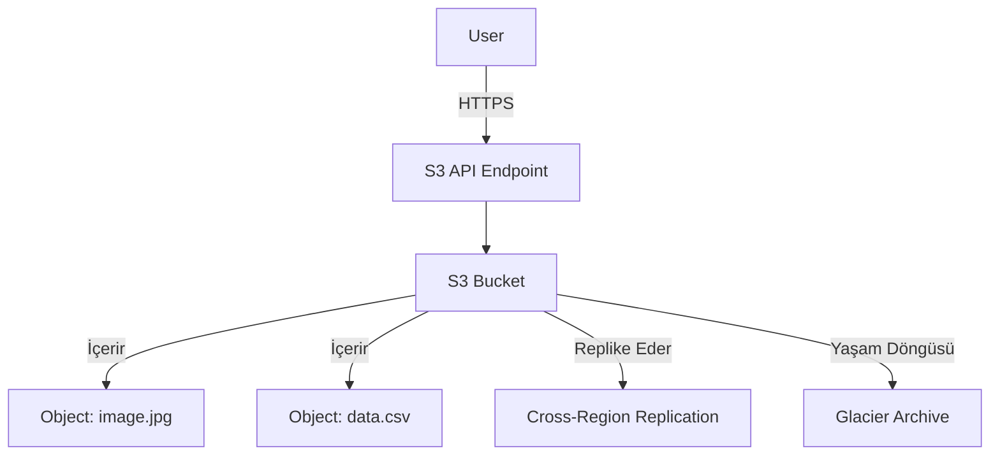

# AWS S3 – Bulut İçin Sonsuz Depolama

## 1. Hangi Sorunu Çözer?
Buluttan Önce: SAN/NAS yönetmek, disk alanının bitmesinden endişe etmek ve karmaşık yedeklemelerle uğraşmak zorundaydınız.
**S3 (Simple Storage Service) ile:** Sonsuz, dayanıklı nesne depolama alanı elde edersiniz. Sunucu veya dosya sistemi yönetmezsiniz. Sadece dosyaları (nesneleri) yüklersiniz ve sakladığınız kadar ödersiniz.

## 2. Mimari ve Temel Bileşenler

### Mimari Diyagramı


### Temel Bileşenler
1.  **Bucket:** Nesneler için bir kap. **Global olarak benzersiz bir isme** sahip olmalıdır (DNS uyumlu). Bölgeye (Region) özgüdür.
2.  **Object (Nesne):** Dosyanın kendisi. Şunlardan oluşur:
    *   **Key:** İsim (örn: `photos/2023/beach.jpg`).
    *   **Value:** Veri (bytes).
    *   **Metadata:** Sistem (tarih, boyut) ve Kullanıcı tanımlı etiketler.
3.  **Region:** Bucket'lar belirli bir AWS bölgesinde (örn: `us-east-1`) yaşar, ancak isim alanı globaldir.
4.  **Tutarlılık (Consistency):** Tüm PUT ve DELETE işlemleri için güçlü tutarlılık (strong consistency) sağlar (yazdıktan hemen sonra okuyabilirsiniz).

## 3. Gerçek Dağıtım Senaryoları

### Senaryo A: Statik Web Sitesi Barındırma
*   **Amaç:** React/Vue/Angular uygulamasını ucuza barındırmak.
*   **Kurulum:** Bucket üzerinde "Static Website Hosting"i açın. Route53'ü bucket endpoint'ine yönlendirin. HTTPS ve önbellekleme (caching) için CloudFront kullanın.

### Senaryo B: Veri Gölü (Data Lake)
*   **Amaç:** Analitik için logları, IoT verilerini ve DB dökümlerini ham halde saklamak.
*   **Kurulum:** Veriyi S3'e aktarın. Athena kullanarak doğrudan SQL ile sorgulayın. ETL işlemleri için Glue kullanın.

### Senaryo C: Hibrit Yedekleme
*   **Amaç:** Şirket içi (on-premise) sunucu verilerini buluta yedeklemek.
*   **Kurulum:** Bir S3 bucket'ını yerel sunucunuza NFS sürücüsü olarak bağlamak için AWS Storage Gateway (File Gateway) kullanın.

## 4. Güvenlik En İyi Uygulamaları
1.  **Genel Erişimi Engelleyin (Block Public Access):** Halka açık bir web sitesi değilse, hesap veya bucket seviyesinde "Block Public Access"i açın.
2.  **Bucket Politikaları:** Erişimi kontrol etmek için JSON tabanlı politikalar (örn: "Sadece CloudFront dosyaları okuyabilsin").
3.  **Şifreleme:**
    *   **SSE-S3:** AWS tarafından yönetilen anahtarlar (Varsayılan).
    *   **SSE-KMS:** Müşteri tarafından yönetilen anahtarlar (Daha fazla kontrol, denetim logları).
4.  **Sürümleme (Versioning):** Kazara silmelere veya üzerine yazmalara karşı korumak için sürümlemeyi açın.

## 5. Maliyet Optimizasyonu (Depolama Sınıfları)

| Sınıf | Kullanım Durumu | Maliyet | Erişim Süresi |
| :--- | :--- | :--- | :--- |
| **S3 Standard** | Sık erişilen veriler. | $$$ | Anlık |
| **S3 Intelligent-Tiering** | Bilinmeyen erişim modelleri. Veriyi otomatik taşır. | $$ | Anlık |
| **S3 Standard-IA** | Seyrek Erişim (yedekler). | $$ | Anlık (Erişim ücreti var) |
| **S3 One Zone-IA** | Yeniden oluşturulabilir veriler (ikincil yedek). | $ | Anlık (Erişim ücreti var) |
| **S3 Glacier Instant** | Arşiv, nadiren erişilir ama hızlı lazım. | $ | Milisaniye |
| **S3 Glacier Deep Archive** | Uzun vadeli saklama (uyumluluk/yasal). | ¢ | 12-48 Saat |

*   **Yaşam Döngüsü Politikaları (Lifecycle Policies):** Nesneleri otomatik olarak daha ucuz katmanlara taşıyın (örn: "90 gün sonra Glacier'a taşı").

## 6. Infrastructure as Code (Terraform)

```hcl
resource "aws_s3_bucket" "my_bucket" {
  bucket = "my-unique-app-bucket-123"

  tags = {
    Environment = "Dev"
  }
}

resource "aws_s3_bucket_versioning" "versioning" {
  bucket = aws_s3_bucket.my_bucket.id
  versioning_configuration {
    status = "Enabled"
  }
}

resource "aws_s3_bucket_server_side_encryption_configuration" "encrypt" {
  bucket = aws_s3_bucket.my_bucket.id
  rule {
    apply_server_side_encryption_by_default {
      sse_algorithm = "AES256"
    }
  }
}
```

## 7. AWS CLI Örnekleri

| İşlem | Komut |
| :--- | :--- |
| **Bucket Oluştur** | `aws s3 mb s3://my-bucket-name` |
| **Bucket Listele** | `aws s3 ls` |
| **Dosya Yükle** | `aws s3 cp file.txt s3://my-bucket-name/` |
| **Klasör Eşitle** | `aws s3 sync ./local-folder s3://my-bucket-name/remote-folder` |
| **Bucket Sil** | `aws s3 rb s3://my-bucket-name --force` (İçindekileri de siler) |

## 8. Sık Karşılaşılan Sınav Soruları (SAA-C03 / DVA-C02)

**S1: Uyumluluk loglarını 7 yıl saklamanız gerekiyor. Erişim çok nadir (yılda bir) ancak 12 saat içinde olmalı. En ucuz sınıf hangisidir?**
*   A) S3 Standard
*   B) S3 Intelligent-Tiering
*   C) S3 Glacier Deep Archive ✅
*   D) S3 Standard-IA
*   *Sebep: 12 saatlik erişim süresinin kabul edilebilir olduğu uzun vadeli saklama için en ucuzu Deep Archive'dır.*

**S2: Bir S3 nesnesinin belirli bir süre boyunca silinememesini veya üzerine yazılamamasını (WORM modeli) nasıl sağlarsınız?**
*   A) Versioning açarak
*   B) MFA Delete kullanarak
*   C) S3 Object Lock kullanarak ✅
*   D) Bucket Policy ile
*   *Sebep: Object Lock (Governance veya Compliance modu) Write-Once-Read-Many kuralını zorunlu kılar.*

**S3: S3 üzerinde statik bir web sitesi barındırmak istiyorsunuz ancak bucket isminiz alan adınızla eşleşmiyor. Ne yapmalısınız?**
*   A) CNAME kaydı kullanın.
*   B) CloudFront kullanın. ✅
*   C) İmkansız, isimler eşleşmeli.
*   D) Route53 Alias kullanın.
*   *Sebep: S3 statik hosting, sadece S3 doğrudan kullanılıyorsa bucket isminin alan adıyla eşleşmesini gerektirir. CloudFront kullanılıyorsa bucket isminin önemi yoktur.*
