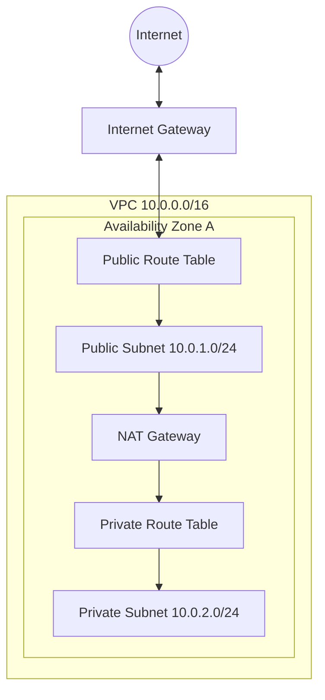

# AWS VPC – Virtual Private Cloud

## 1. What It Solves
Before Cloud: You physically cabled switches and routers to isolate networks.
**With VPC:** You provision a logically isolated section of the AWS Cloud. You have complete control over your virtual networking environment, including IP ranges, subnets, and route tables.

## 2. Architecture & Key Components

### Architecture Diagram


### Key Components
1.  **CIDR Block:** The IP range for the VPC (e.g., `10.0.0.0/16` = 65,536 IPs).
2.  **Subnets:** Segments of the VPC IP range. Must live in a specific Availability Zone (AZ).
    *   **Public Subnet:** Has a route to an Internet Gateway (IGW).
    *   **Private Subnet:** No direct route to IGW. Uses NAT Gateway for outbound access.
3.  **Internet Gateway (IGW):** The door to the internet. One per VPC.
4.  **Route Tables:** Rules (routes) that determine where network traffic is directed.
5.  **NAT Gateway:** Allows private instances to talk to the internet (for updates) but prevents internet from talking to them.
6.  **NACL (Network ACL):** Stateless firewall at the subnet level.
7.  **Security Group:** Stateful firewall at the instance level.

## 3. Real Deployment Patterns

### Pattern A: Public & Private Subnets (The Standard)
*   **Goal:** Host a web app securely.
*   **Setup:**
    *   **Public Subnet:** Load Balancer (ALB), Bastion Host.
    *   **Private Subnet:** Web Servers (EC2), Database (RDS).
    *   **Flow:** User -> ALB -> Web Server -> DB.

### Pattern B: VPC Peering
*   **Goal:** Connect two VPCs (e.g., Shared Services VPC <-> Prod VPC).
*   **Setup:** Create a Peering Connection. Update Route Tables in *both* VPCs to point to the Peering ID (`pcx-xxxx`).
*   **Note:** Peering is non-transitive (A <-> B and B <-> C does NOT mean A <-> C).

## 4. Security Best Practices
1.  **Security Groups over NACLs:** Use SGs for primary filtering. They are easier to manage (Stateful). Use NACLs only for explicit blocking (e.g., block a specific malicious IP).
2.  **No Public IPs for Backends:** Databases and App servers should NEVER have public IPs.
3.  **Flow Logs:** Enable VPC Flow Logs to monitor traffic (accepted/rejected) for auditing.
4.  **Bastion Hosts:** If you need SSH access, use a Bastion in the public subnet or, better yet, **SSM Session Manager** (no ports needed).

## 5. Cost Optimization
*   **NAT Gateways:** Expensive (~$0.045/hr + data processing).
    *   *Tip:* Use VPC Endpoints (Gateway type) for S3 and DynamoDB to avoid NAT costs for AWS services.
*   **Data Transfer:** Transfer between AZs costs money. Keep chatty services in the same AZ if HA isn't critical.
*   **Public IPs:** AWS now charges for public IPv4 addresses. Use private IPs where possible.

## 6. Infrastructure as Code (Terraform)

```hcl
resource "aws_vpc" "main" {
  cidr_block = "10.0.0.0/16"
}

resource "aws_subnet" "public" {
  vpc_id     = aws_vpc.main.id
  cidr_block = "10.0.1.0/24"
  map_public_ip_on_launch = true
}

resource "aws_internet_gateway" "gw" {
  vpc_id = aws_vpc.main.id
}

resource "aws_route_table" "public_rt" {
  vpc_id = aws_vpc.main.id

  route {
    cidr_block = "0.0.0.0/0"
    gateway_id = aws_internet_gateway.gw.id
  }
}
```

## 7. AWS CLI Examples

| Action | Command |
| :--- | :--- |
| **Create VPC** | `aws ec2 create-vpc --cidr-block 10.0.0.0/16` |
| **Create Subnet** | `aws ec2 create-subnet --vpc-id vpc-xxx --cidr-block 10.0.1.0/24` |
| **Create IGW** | `aws ec2 create-internet-gateway` |
| **Attach IGW** | `aws ec2 attach-internet-gateway --vpc-id vpc-xxx --internet-gateway-id igw-xxx` |

## 8. Common Exam Questions (SAA-C03 / DVA-C02)

**Q1: You have an EC2 instance in a private subnet that needs to download updates from the internet. What do you need?**
*   A) Internet Gateway
*   B) NAT Gateway ✅
*   C) VPC Peering
*   D) Egress-Only Internet Gateway
*   *Reason: NAT Gateway allows outbound traffic for private subnets. Egress-Only is for IPv6.*

**Q2: You blocked an IP in the Security Group, but the traffic is still getting through. Why?**
*   A) Security Groups are stateless.
*   B) Security Groups cannot block (deny) traffic. ✅
*   C) You need to restart the instance.
*   D) The rule takes 24 hours to apply.
*   *Reason: Security Groups are "Allow Only". To explicitly DENY an IP, you must use a Network ACL (NACL).*

**Q3: Can you peer two VPCs with overlapping CIDR blocks (e.g., both are 10.0.0.0/16)?**
*   A) Yes.
*   B) No. ✅
*   C) Only if they are in different regions.
*   D) Only if you use a Transit Gateway.
*   *Reason: Overlapping CIDRs break routing. You cannot peer them.*
