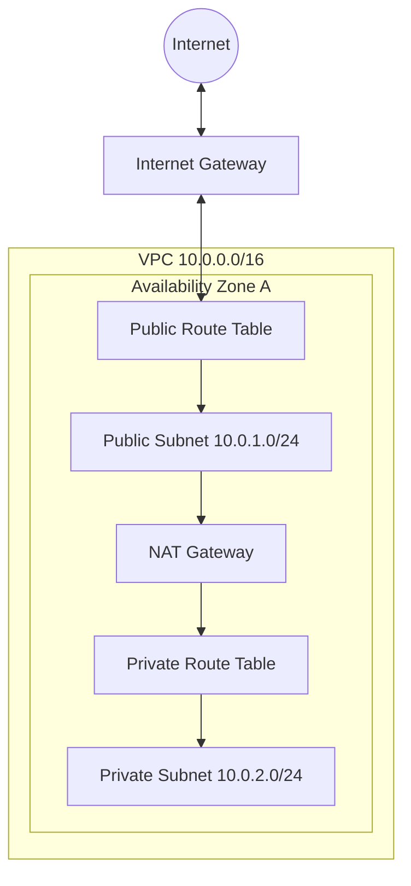

# AWS VPC – Sanal Özel Bulut (Virtual Private Cloud)

## 1. Hangi Sorunu Çözer?
Buluttan Önce: Ağları izole etmek için fiziksel olarak switch ve router kablolamanız gerekirdi.
**VPC ile:** AWS Bulutu içinde mantıksal olarak izole edilmiş bir bölüm oluşturursunuz. IP aralıkları, alt ağlar (subnet) ve yönlendirme tabloları (route table) dahil olmak üzere sanal ağ ortamınız üzerinde tam kontrole sahip olursunuz.

## 2. Mimari ve Temel Bileşenler

### Mimari Diyagramı


### Temel Bileşenler
1.  **CIDR Block:** VPC için IP aralığı (örn: `10.0.0.0/16` = 65,536 IP).
2.  **Subnets (Alt Ağlar):** VPC IP aralığının bölümleri. Belirli bir Availability Zone (AZ) içinde bulunmalıdır.
    *   **Public Subnet:** Internet Gateway'e (IGW) rotası vardır.
    *   **Private Subnet:** IGW'ye doğrudan rotası yoktur. Dışarı çıkmak için NAT Gateway kullanır.
3.  **Internet Gateway (IGW):** İnternete açılan kapı. VPC başına bir tane olur.
4.  **Route Tables:** Ağ trafiğinin nereye yönlendirileceğini belirleyen kurallar (rotalar).
5.  **NAT Gateway:** Özel (private) instance'ların internete konuşmasını (güncellemeler için) sağlar ancak internetin onlara ulaşmasını engeller.
6.  **NACL (Network ACL):** Subnet seviyesinde durumsuz (stateless) güvenlik duvarı.
7.  **Security Group:** Instance seviyesinde durumlu (stateful) güvenlik duvarı.

## 3. Gerçek Dağıtım Senaryoları

### Senaryo A: Public & Private Subnetler (Standart)
*   **Amaç:** Bir web uygulamasını güvenli bir şekilde barındırmak.
*   **Kurulum:**
    *   **Public Subnet:** Load Balancer (ALB), Bastion Host.
    *   **Private Subnet:** Web Sunucuları (EC2), Veritabanı (RDS).
    *   **Akış:** Kullanıcı -> ALB -> Web Sunucusu -> DB.

### Senaryo B: VPC Peering
*   **Amaç:** İki VPC'yi birbirine bağlamak (örn: Ortak Servisler VPC <-> Prod VPC).
*   **Kurulum:** Bir Peering Bağlantısı oluşturun. *Her iki* VPC'deki Route Table'ları Peering ID'sine (`pcx-xxxx`) yönlendirecek şekilde güncelleyin.
*   **Not:** Peering geçişli (transitive) değildir (A <-> B ve B <-> C varsa, A <-> C konuşamaz).

## 4. Güvenlik En İyi Uygulamaları
1.  **NACL yerine Security Group:** Birincil filtreleme için SG kullanın. Yönetimi daha kolaydır (Stateful). NACL'leri sadece açıkça engelleme (explicit blocking) için kullanın (örn: belirli bir saldırgan IP'yi engellemek).
2.  **Backend İçin Public IP Yok:** Veritabanları ve Uygulama sunucuları ASLA public IP'ye sahip olmamalıdır.
3.  **Flow Logs:** Denetim (audit) için trafiği (kabul edilen/reddedilen) izlemek üzere VPC Flow Logs'u etkinleştirin.
4.  **Bastion Host:** SSH erişimine ihtiyacınız varsa, public subnet'te bir Bastion kullanın veya daha iyisi **SSM Session Manager** kullanın (port açmaya gerek kalmaz).

## 5. Maliyet Optimizasyonu
*   **NAT Gateway:** Pahalıdır (~$0.045/saat + veri işleme).
    *   *İpucu:* AWS servisleri (S3, DynamoDB) için NAT maliyetinden kaçınmak adına VPC Endpoints (Gateway tipi) kullanın.
*   **Veri Transferi:** AZ'ler arası transfer ücretlidir. Yüksek erişilebilirlik (HA) kritik değilse, çok konuşan servisleri aynı AZ'de tutun.
*   **Public IP:** AWS artık public IPv4 adresleri için ücret almaktadır. Mümkün olduğunca private IP kullanın.

## 6. Infrastructure as Code (Terraform)

```hcl
resource "aws_vpc" "main" {
  cidr_block = "10.0.0.0/16"
}

resource "aws_subnet" "public" {
  vpc_id     = aws_vpc.main.id
  cidr_block = "10.0.1.0/24"
  map_public_ip_on_launch = true
}

resource "aws_internet_gateway" "gw" {
  vpc_id = aws_vpc.main.id
}

resource "aws_route_table" "public_rt" {
  vpc_id = aws_vpc.main.id

  route {
    cidr_block = "0.0.0.0/0"
    gateway_id = aws_internet_gateway.gw.id
  }
}
```

## 7. AWS CLI Örnekleri

| İşlem | Komut |
| :--- | :--- |
| **VPC Oluştur** | `aws ec2 create-vpc --cidr-block 10.0.0.0/16` |
| **Subnet Oluştur** | `aws ec2 create-subnet --vpc-id vpc-xxx --cidr-block 10.0.1.0/24` |
| **IGW Oluştur** | `aws ec2 create-internet-gateway` |
| **IGW Bağla** | `aws ec2 attach-internet-gateway --vpc-id vpc-xxx --internet-gateway-id igw-xxx` |

## 8. Sık Karşılaşılan Sınav Soruları (SAA-C03 / DVA-C02)

**S1: Private subnet'teki bir EC2 instance'ının internetten güncelleme indirmesi gerekiyor. Neye ihtiyacınız var?**
*   A) Internet Gateway
*   B) NAT Gateway ✅
*   C) VPC Peering
*   D) Egress-Only Internet Gateway
*   *Sebep: NAT Gateway, private subnet'ler için giden trafiğe izin verir. Egress-Only IPv6 içindir.*

**S2: Security Group'ta bir IP'yi engellediniz ama trafik hala geçiyor. Neden?**
*   A) Security Group'lar stateless'tır.
*   B) Security Group'lar trafiği engelleyemez (deny). ✅
*   C) Instance'ı yeniden başlatmanız gerekir.
*   D) Kuralın uygulanması 24 saat sürer.
*   *Sebep: Security Group'lar "Sadece İzin Ver" (Allow Only) mantığıyla çalışır. Bir IP'yi açıkça REDDETMEK (DENY) için Network ACL (NACL) kullanmalısınız.*

**S3: Çakışan CIDR bloklarına sahip iki VPC'yi (örn: ikisi de 10.0.0.0/16) peer edebilir misiniz?**
*   A) Evet.
*   B) Hayır. ✅
*   C) Sadece farklı bölgelerdelerse.
*   D) Sadece Transit Gateway kullanırsanız.
*   *Sebep: Çakışan CIDR'lar yönlendirmeyi bozar. Onları peer edemezsiniz.*
